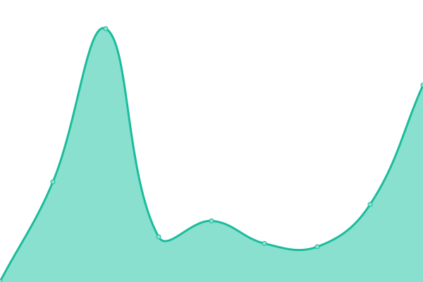

# Securityium Service Status Updates

Welcome to our service status page, where you can find real-time updates on the availability and performance of our systems. We understand the importance of transparency and reliability in our services, and we are committed to keeping you informed about any interruptions or issues that may impact your experience.

Please check below for the current status of our services. If you encounter any problems not listed here, or if you have any questions, please don't hesitate to reach out to our support team.

<!--start: status pages-->
<!-- This summary is generated by Upptime (https://github.com/upptime/upptime) -->
<!-- Do not edit this manually, your changes will be overwritten -->
<!-- prettier-ignore -->
| URL | Status | History | Response Time | Uptime |
| --- | ------ | ------- | ------------- | ------ |
|  [Securityium Website](https://www.securityium.com/) | 🟩 Up | [securityium-website.yml](https://github.com/securityium/uptime-status/commits/HEAD/history/securityium-website.yml) | 

 245ms
     
 | 

<a href="https://status.prosecurity.work/history/securityium-website">100.00%</a>
    

|  [Client Portal](https://clients.prosecurity.work/) | 🟩 Up | [client-portal.yml](https://github.com/securityium/uptime-status/commits/HEAD/history/client-portal.yml) | 

 179ms
     
 | 

<a href="https://status.prosecurity.work/history/client-portal">100.00%</a>
    

|  [Management Portal](https://projects.prosecurity.work/) | 🟩 Up | [management-portal.yml](https://github.com/securityium/uptime-status/commits/HEAD/history/management-portal.yml) | 

 114ms
     
 | 

<a href="https://status.prosecurity.work/history/management-portal">100.00%</a>
    

|  [API Service Portal](https://api.prosecurity.work/) | 🟥 Down | [api-service-portal.yml](https://github.com/securityium/uptime-status/commits/HEAD/history/api-service-portal.yml) | 

 0ms
     
 | 

<a href="https://status.prosecurity.work/history/api-service-portal">100.00%</a>
    

<!--end: status pages-->

[**Visit our status website →**](https://securityium.github.io/uptime-status)

Thank you for choosing Securityium.

## 📄 License

- Powered by: [Upptime](https://github.com/upptime/upptime)
- Code: [MIT](./LICENSE) © [Anand Chowdhary](https://anandchowdhary.com), supported by [Pabio](https://pabio.com)
- Data in the `./history` directory: [Open Database License](https://opendatacommons.org/licenses/odbl/1-0/)
